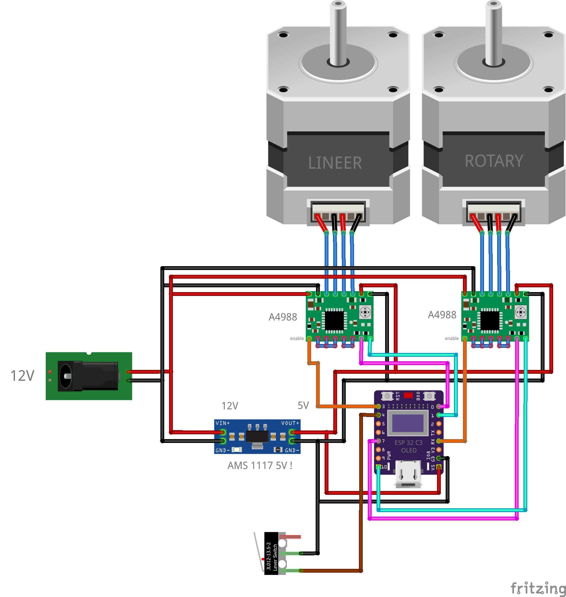

# Camera Slider — Fergineer Slider

ESP32-C3 tabanlı, WiFi üzerinden kontrol edilen 2 eksenli motorlu kamera slider'ı.
Lineer eksen kamerayı GT2 kayışlı bir ray üzerinde taşır, rotary (pan) eksen ise
ray üzerindeki platformu 360° döndürür. Tüm kontrol telefon/bilgisayar
tarayıcısından çalışan web arayüzüyle yapılır — uygulama kurmak gerekmez.

## Özellikler

- **2 eksen:** lineer slider (NEMA 17 + GT2 kayış) ve 360° pan platformu (NEMA 17 direkt tahrik)
- **Web arayüzü:** cihaz üzerindeki LittleFS'ten sunulur; canlı durum ve kontrol WebSocket üzerinden
- **WiFi:** ev ağına bağlanır (`camera-slider.local`), bağlanamazsa kendi hotspot'unu açar
  (SSID `CameraSlider`, captive portal ile kurulum sayfası otomatik açılır)
- **Otomatik hareket:** başlangıç/bitiş noktaları arasında ayarlanabilir hızda gidiş-geliş,
  iki eksen ortak saat üzerinden senkron çalışır
- **Homing:** limit switch ile lineer eksen sıfırlama (hızlı yaklaş → geri çekil → yavaş tekrar yaklaş)
- **Jog:** web arayüzünden elle sürme, hız ayarlanabilir
- **OLED:** kart üzerindeki 0.42" ekranda IP adresi ve durum bilgisi
- Adım üretimi [FastAccelStepper](https://github.com/gin66/FastAccelStepper) ile donanım destekli

## Donanım

| Parça | Açıklama |
|---|---|
| ESP32-C3 0.42" OLED SuperMini | Ana kontrolcü (dahili SSD1306 72×40 OLED) |
| 2× A4988 | Step motor sürücüleri (1/16 mikro adım) |
| 2× NEMA 17 | 1.8°/adım; biri lineer eksen, biri pan |
| AMS1117 5V regülatör modülü | 12V → 5V (ESP32 beslemesi) |
| Lever limit switch (JL012-13.5-2) | Lineer eksen sıfır noktası |
| 12V adaptör + barrel jack | Motor beslemesi |

## Bağlantı şeması



Yüksek çözünürlüklü PDF: [docs/baglanti-semasi.pdf](docs/baglanti-semasi.pdf)

### Pin haritası

| ESP32-C3 pini | Nereye gidiyor | Not |
|---|---|---|
| GPIO0 | A4988 #1 — STEP | Lineer eksen adım sinyali |
| GPIO1 | A4988 #1 — DIR | Lineer eksen yön |
| GPIO3 | A4988 #1 — ENABLE | Aktif LOW (LOW = sürücü etkin) |
| GPIO4 | Limit switch → GND | `INPUT_PULLUP`; basılınca LOW |
| GPIO7 | A4988 #2 — STEP | Pan ekseni adım sinyali |
| GPIO10 | A4988 #2 — DIR | Pan ekseni yön |
| GPIO20 | A4988 #2 — ENABLE | UART0-TX pini; Serial USB-CDC'de olduğundan serbest |
| GPIO21 | Pan limit switch (rezerve) | Bağlı değil, `PAN_HAS_LIMIT=0` |
| GPIO5 / GPIO6 | Dahili OLED SDA / SCL | Kart üzerinde sabit; I²C `0x3C` |
| 5V | AMS1117 çıkışı | ESP32 beslemesi (USB takılıyken gerekmez) |
| 3V3 | Her iki A4988 — VDD | Sürücü lojik beslemesi |
| GND | Ortak toprak | ESP + sürücüler + 12V kaynak + limit switch |

**A4988 kurulumu:** RESET ↔ SLEEP köprülü; MS1 = MS2 = MS3 = HIGH → 1/16 mikro adım
(koddaki `DRIVER_MICROSTEP 16` ile eşleşmeli); her sürücünün VMOT–GND arasına
100 µF kondansatör. Akım limiti Vref potuyla ayarlanır.

**Kaçınılacak pinler:** GPIO2, GPIO8, GPIO9 (strapping/BOOT), GPIO18/19 (USB D−/D+), GPIO11–17 (flash).

## Mekanik / kalibrasyon varsayılanları

- Lineer: 200 adım/tur × 16 mikro adım = 3200 adım/tur; GT2 20T kasnak (40 mm/tur) → **80 adım/mm**
- Pan: direkt tahrik, 3200 adım = 360°
- Maks. yol 300 mm, maks. hız 50 mm/s — hepsi web arayüzünden değiştirilebilir ve kalıcı saklanır

## Derleme ve yükleme

Proje [PlatformIO](https://platformio.org/) ile derlenir:

```
pio run -t upload          # firmware
pio run -t uploadfs        # web arayüzü (data/ → LittleFS)
```

İlk açılışta cihaz `CameraSlider` isimli hotspot açar (şifre `12345678`).
Bağlanınca açılan sayfadan ev ağı bilgileri girilir; sonrasında cihaza
`http://camera-slider.local` adresinden erişilir.

## Proje yapısı

```
src/            Firmware kaynak kodu (Config.h: tüm pin ve varsayılan ayarlar)
data/           Web arayüzü (LittleFS'e yüklenir)
docs/           Bağlantı şeması (PNG + PDF, Fritzing çizimi)
platformio.ini  Derleme yapılandırması
```
