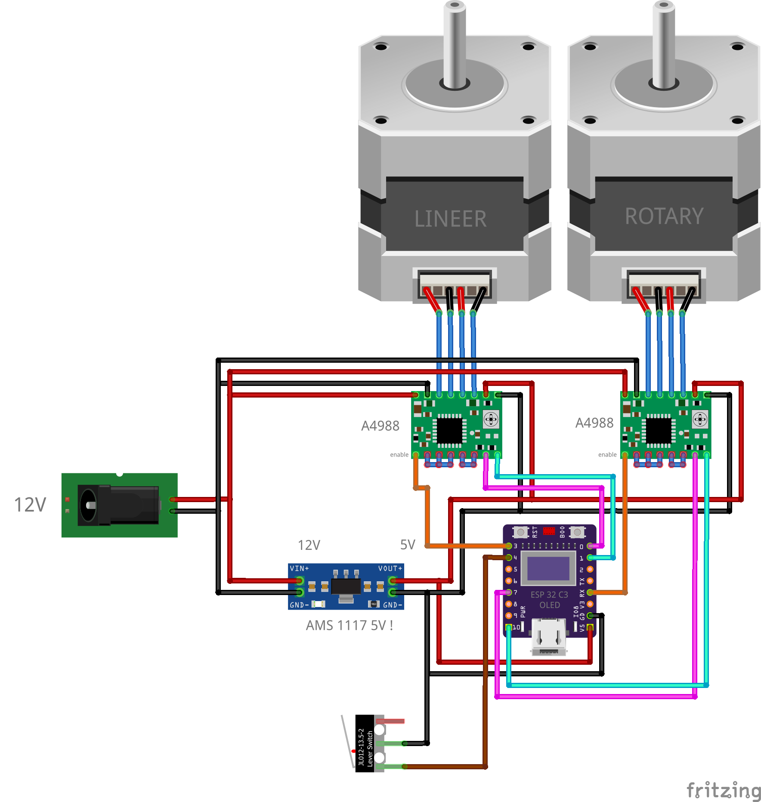

# Camera Slider

ESP32-C3 tabanlı, WiFi üzerinden kontrol edilen 2 eksenli motorlu kamera slider'ı.
Lineer eksen kamerayı GT2 kayışlı bir ray üzerinde taşır, rotary (pan) eksen ise
ray üzerindeki platformu 360° döndürür. Tüm kontrol telefon/bilgisayar
tarayıcısından çalışan web arayüzüyle yapılır — uygulama kurmak gerekmez.

## Özellikler

- **2 eksen:** lineer slider (NEMA 17 + GT2 kayış) ve 360° pan platformu (NEMA 17 direkt tahrik)
- **Web arayüzü:** cihaz üzerindeki LittleFS'ten sunulur; canlı durum ve kontrol WebSocket üzerinden
- **WiFi:** ev ağına bağlanır (`camera-slider.local`), bağlanamazsa kendi hotspot'unu açar
  (SSID `CameraSlider`, captive portal ile kurulum sayfası otomatik açılır)
- **Otomatik hareket:** başlangıç/bitiş noktaları arasında ayarlanabilir hızda gidiş-geliş,
  iki eksen ortak saat üzerinden senkron çalışır
- **Homing:** limit switch ile lineer eksen sıfırlama (hızlı yaklaş → geri çekil → yavaş tekrar yaklaş)
- **Jog:** web arayüzünden elle sürme, hız ayarlanabilir
- **OLED:** kart üzerindeki 0.42" ekranda IP adresi; açılışta Wi-Fi deneme sayacı,
  hotspot modunda ağ adı ve şifre
- Adım üretimi [FastAccelStepper](https://github.com/gin66/FastAccelStepper) ile donanım destekli

## İlk kullanım

1. Cihaza güç verin. Kayıtlı bir ağ yoksa **`CameraSlider`** isimli hotspot'u açar
   (şifre `12345678`).
2. Telefonunuzla bu ağa bağlanın. Kurulum sayfası kendiliğinden açılır; açılmazsa
   tarayıcıya elle **`http://192.168.4.1`** yazın (başındaki `http://` önemli).
3. Listeden ev ağınızı seçip şifresini girin. Cihaz yeniden bağlanır.
4. Bundan sonra kontrol arayüzüne **`http://camera-slider.local`** adresinden
   ulaşırsınız — IP adresi kart üzerindeki OLED ekranda da yazar.

## Arayüz


## PrintLapse ile kullanım

 DÜZENLENECEK !!

## Donanım

| Parça | Açıklama |
|---|---|
| ESP32-C3 0.42" OLED SuperMini | Ana kontrolcü (dahili SSD1306 72×40 OLED) |
| 2× A4988 | Step motor sürücüleri (1/16 mikro adım) |
| 2× NEMA 17 | 1.8°/adım; biri lineer eksen, biri pan |
| AMS1117 5V regülatör modülü | 12V → 5V (ESP32 beslemesi) |
| Lever limit switch (JL012-13.5-2) | Lineer eksen sıfır noktası |
| 12V adaptör + barrel jack | Motor beslemesi |

### Mekanik / bağlantı malzemeleri

| Parça | Adet | Not |
|---|---|---|
| 20 × 40 mm sigma profil, 300 mm | 1 | Slider gövdesi |
| 8 mm çap, 300 mm lineer mil | 2 | Araba kızağı |
| LM8UU lineer rulman | 2 | 8 mm mil için |
| M3 × 10 mm cıvata | 17 | Genel montaj |
| M3 × 25 mm cıvata | 2 | — |
| M3 somun | 4 | — |
| M3 insert somun (ısıyla gömme) | 7 | 3D baskı parçalara gömülür |
| M5 × 25 mm cıvata | 1 | Telefon tutucu bağlantısı |
| M5 somun | 1 | Telefon tutucu bağlantısı |
| 30 × 70 mm delikli pertinaks | 1 | Sürücü/kablo bağlantı kartı |

## Bağlantı şeması



Yüksek çözünürlüklü PDF: [docs/baglanti-semasi.pdf](docs/baglanti-semasi.pdf)

### Pin haritası

| ESP32-C3 pini | Nereye gidiyor | Not |
|---|---|---|
| GPIO0 | A4988 #1 — STEP | Lineer eksen adım sinyali |
| GPIO1 | A4988 #1 — DIR | Lineer eksen yön |
| GPIO3 | A4988 #1 — ENABLE | Aktif LOW (LOW = sürücü etkin) |
| GPIO4 | Limit switch → GND | `INPUT_PULLUP`; basılınca LOW |
| GPIO7 | A4988 #2 — STEP | Pan ekseni adım sinyali |
| GPIO10 | A4988 #2 — DIR | Pan ekseni yön |
| GPIO20 | A4988 #2 — ENABLE | UART0-TX pini; Serial USB-CDC'de olduğundan serbest |
| GPIO21 | Pan limit switch (rezerve) | Bağlı değil, `PAN_HAS_LIMIT=0` |
| GPIO5 / GPIO6 | Dahili OLED SDA / SCL | Kart üzerinde sabit; I²C `0x3C` |
| 5V | AMS1117 çıkışı | ESP32 beslemesi (USB takılıyken gerekmez) |
| 3V3 | Her iki A4988 — VDD | Sürücü lojik beslemesi |
| GND | Ortak toprak | ESP + sürücüler + 12V kaynak + limit switch |

**A4988 kurulumu:** RESET ↔ SLEEP köprülü; MS1 = MS2 = MS3 = HIGH → 1/16 mikro adım
(koddaki `DRIVER_MICROSTEP 16` ile eşleşmeli); her sürücünün VMOT–GND arasına
100 µF kondansatör. Akım limiti Vref potuyla ayarlanır.

**Kaçınılacak pinler:** GPIO2, GPIO8, GPIO9 (strapping/BOOT), GPIO18/19 (USB D−/D+), GPIO11–17 (flash).

## Montaj bilgileri

https://github.com/user-attachments/assets/d8921941-d690-4528-93d0-fbbbbc627310


### 3D baskı parçaları

Basılması gereken tüm parçaların STL dosyaları [`3d-models/`](3d-models/)
klasöründe:

```
3d-models/
├── slider/           Projeye özel parçalar (motor yatakları, araba, kayış tutucu vb.)
└── telefon-tutucu/   Telefon tutucu modülleri (harici tasarım — aşağıya bakın)
```

Önerilen baskı ayarları ve parça listesi için [`3d-models/README.md`](3d-models/README.md)
dosyasına bakın.

#### Telefon tutucu — atıf

`3d-models/telefon-tutucu/` içindeki modeller bana ait değil:
[HeyVye](https://www.thingiverse.com/thing:2194278) tarafından tasarlanan
**Modular Mounting System** projesinden, Creative Commons Attribution (CC BY)
lisansıyla. Kullanıcı ayrıca aramak zorunda kalmasın diye repoya ekledim.
Bu kısmın montajı için orijinal sayfadaki talimatları izleyin — modüller M5
cıvata/somun ile birleşir, bağlantı noktası GoPro uyumludur.

## Mekanik / kalibrasyon varsayılanları

- Lineer: 200 adım/tur × 16 mikro adım = 3200 adım/tur; GT2 20T kasnak (40 mm/tur) → **80 adım/mm**
- Pan: direkt tahrik, 3200 adım = 360°
- Maks. yol 300 mm, maks. hız 50 mm/s — hepsi web arayüzünden değiştirilebilir ve kalıcı saklanır

## Derleme ve yükleme

Proje [PlatformIO](https://platformio.org/) ile derlenir:

```
pio run -t upload          # firmware
pio run -t uploadfs        # web arayüzü (data/ → LittleFS)
```

İkisini de yükledikten sonra cihaz açılışta hotspot'unu açar — devamı için
[İlk kullanım](#ilk-kullanım) bölümüne bakın.

## Sorun giderme

### Slider beklendiği gibi çalışmıyorsa: önce Wi-Fi mesafesine bakın

Uygulamada sık sık **"Bağlı değil"** görmek, komutların gecikmesi, kareler arasında
slider'ın hareket etmemesi ya da açılışta ev ağına bağlanamayıp hotspot moduna
düşmesi gibi sorunların büyük çoğunluğunun sebebi **slider'ın modemden uzakta
olmasıdır.**

ESP32-C3 SuperMini kartı, kartın üzerine lehimli küçük bir **SMD (seramik) anten**
kullanır. Harici anten konnektörlü ya da daha büyük PCB antenli ESP32 modellerine
göre hem yayın hem de alış gücü belirgin şekilde düşüktür. Telefonunuzun aynı
noktada rahatça bağlandığı bir ağ, slider için sınırda olabilir.

Yapabilecekleriniz (etkisi büyükten küçüğe):

- **Slider'ı modeme yaklaştırın** ya da aradaki duvar sayısını azaltın. Mümkünse
  modemle aynı odada kullanın; olmuyorsa araya bir Wi-Fi genişletici / mesh noktası koyun.
- **Antenin etrafını boş bırakın.** Antenin 1–1,5 cm çevresinde metal olmasın:
  alüminyum profil, motor kabloları ve kablo demeti anteni "söndürür" (20 dB kayıp
  sıradandır). Kutu içinde antenin metal parçalara değil, plastik duvara bakmasını sağlayın.
- **Motor kablolarını** ikişerli burgu yapın ve antenden uzak geçirin.
- **Beslemeyi güçlendirin.** Wi-Fi yayını sırasında kart anlık olarak yüksek akım
  çeker; 3,3 V hattı çökerse sinyal bozulur. ESP kartının hemen yanına
  470–1000 µF + 100 nF kondansatör koyun, her A4988'in VMOT girişine yakın 100 µF
  ekleyin ve motor topraklamasının ESP'nin toprağı üzerinden dönmemesine dikkat edin.

**Sinyal gücünü ölçmek için** kartı USB ile bilgisayara bağlayıp seri monitörü açın
(`pio device monitor`, 115200 baud). Kart ağa bağlandığında şöyle bir satır yazar:

```
[wifi] connected to EvAgim  RSSI -58 dBm  IP 192.168.1.110
```

| RSSI | Anlamı |
|---|---|
| -30 … -60 dBm | İyi |
| -60 … -70 dBm | Kullanılabilir, ara sıra kopma olabilir |
| -70 dBm'den kötü | Zayıf — kopmalar ve açılışta bağlanamama beklenir |

Zayıf sinyalde seri monitörde `[wifi] attempt 2 failed: AUTH_FAIL` ya da
`[wifi] link lost` satırları da görülür. Şifre doğru olsa bile ESP32 zayıf
sinyalde `AUTH_FAIL` bildirebilir.

### Açılışta ev ağına bağlanamıyor

- Açılışta OLED'de **"Connecting"** ve altında büyük bir **deneme sayısı** görünür.
  Kart, kayıtlı ağa yaklaşık 22 saniye boyunca tekrar tekrar bağlanmayı dener.
- Bağlanamazsa hotspot moduna geçer ve OLED'de **"AP MODE"**, ağ adı (`CameraSlider`)
  ve şifre (`12345678`) yazar.
- Hotspot'a kimse bağlı değilken kart, dakikada bir ev ağını sessizce tekrar dener.
  Modem geç açıldıysa ya da ilk deneme şanssız geçtiyse **reset'e basmadan**
  kendiliğinden bağlanır.
- Her seferinde "AP MODE"a düşüyorsa ya şifre yanlıştır (hotspot'a bağlanıp tekrar
  girin) ya da sinyal zayıftır (yukarıdaki bölüm).

### Kurulum sayfası kendiliğinden açılmıyor

- Tarayıcıya elle **`http://192.168.4.1`** yazın (başındaki `http://` önemli).
- Bazı telefonlar, internet erişimi olmayan bu ağı "internet yok" diye bırakıp mobil
  veriye döner. Telefonun sorduğu "bu ağda kal / bağlı kal" seçeneğini onaylayın ya
  da kurulum süresince mobil veriyi kapatın.

### Uygulamada "Başlangıç ve bitiş ayarlanmamış" yazıyor

Slider'a hiç başlangıç/bitiş noktası kaydedilmemiş demektir. Web arayüzünde
slider'ı istediğiniz konuma sürüp **Use as Start** ve **Use as End** butonlarına
basın. Kaydedilmemiş olan buton turuncu görünür. Firmware güncellemesinden önce
açılmış bir tarayıcı sekmesi kullanıyorsanız önce sayfayı yenileyin.

## Proje yapısı

```
src/            Firmware kaynak kodu (Config.h: tüm pin ve varsayılan ayarlar)
data/           Web arayüzü (LittleFS'e yüklenir)
docs/           Bağlantı şeması (PNG + PDF, Fritzing çizimi)
3d-models/      Basılacak parçaların STL dosyaları
platformio.ini  Derleme yapılandırması
```

## Lisans

Bu projenin kaynak kodu ve tasarım dosyaları MIT lisansı altındadır — bkz.
[LICENSE](LICENSE). `3d-models/telefon-tutucu/` klasörü istisnadır; o parçalar
üçüncü tarafa ait olup CC BY lisansıyla dağıtılır (yukarıdaki atfa bakın).

## Teşekkür

- Telefon tutucu modülleri: **Modular Mounting System** — [HeyVye](https://www.thingiverse.com/thing:2194278) (CC BY)
- Adım üretimi: [FastAccelStepper](https://github.com/gin66/FastAccelStepper) — gin66
